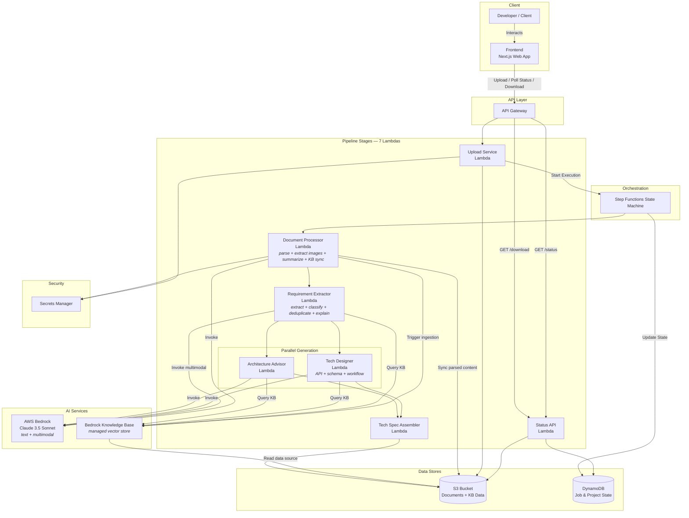
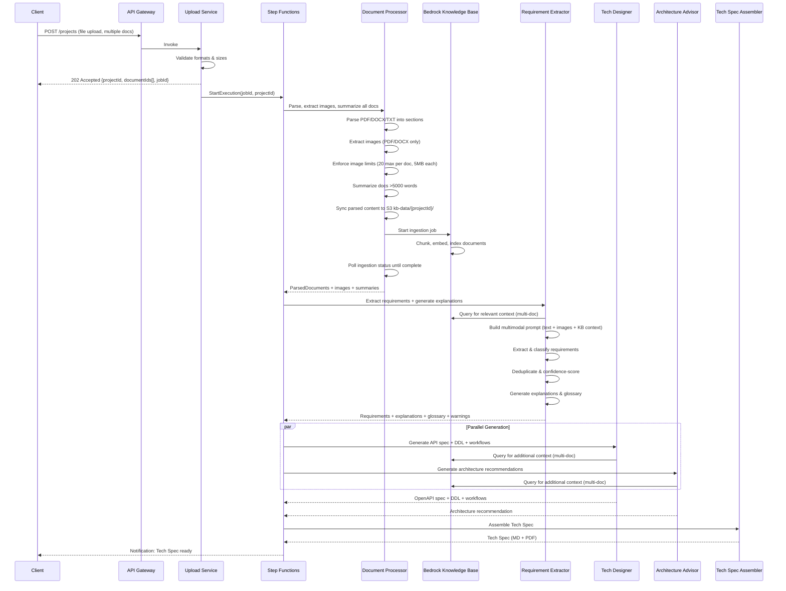
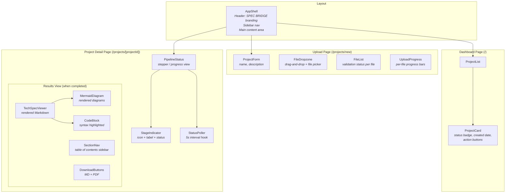

# Design Document: SPEC BRIDGE — BRD-to-Tech-Spec Agent

## Overview

SPEC BRIDGE is a serverless, AI-agent-based system built on AWS that ingests business documents (BRDs, SOPs, policies) and produces structured technical specifications for developers. The system uses AWS Bedrock foundation models for all AI tasks (summarization, extraction, generation) and orchestrates a multi-step pipeline of **7 Lambda functions** from document upload through final tech spec assembly. A **Next.js web application** provides the browser-based frontend for project creation, document upload, real-time processing status monitoring, and tech spec viewing and download.

Documents are uploaded as part of a **Project** — a logical grouping of related business documents that pertain to the same application or initiative. All documents in a Project are processed together to produce a single unified tech spec.

The core flow is:

1. A developer creates a Project and uploads one or more documents (PDF, DOCX, or plain text) through the **Frontend** web application, which calls the REST API via API Gateway.
2. Each document is stored in S3 under a Project-specific prefix with server-side encryption.
3. The **Document Processor** parses each document into structured sections, extracts embedded images (from PDF/DOCX), summarizes documents exceeding 5000 words, and syncs parsed content to the Project's Knowledge Base data source in S3. It then triggers a Bedrock Knowledge Base ingestion job to chunk, embed, and index the documents.
4. The **Requirement Extractor** extracts, classifies, deduplicates, and confidence-scores business requirements, then produces developer-friendly explanations and a glossary — all in a single Bedrock call. For multi-document Projects, it queries the Knowledge Base for relevant context across all documents. For single-document Projects that fit within the context window, it passes full text directly in the prompt. When images are available, they are included as multimodal input.
5. In parallel, two generation agents run: the **Tech Designer** generates API designs, database schemas, and workflows; the **Architecture Advisor** generates architectural recommendations. Both query the Knowledge Base for cross-document context when needed.
6. The **Tech Spec Assembler** combines all artifacts into a single downloadable tech spec (Markdown + PDF).
7. The **Frontend** polls for processing status and, upon completion, renders the generated tech spec with syntax highlighting, Mermaid diagrams, and section navigation, and provides download buttons for Markdown and PDF formats.

### Retrieval Strategy

The system uses a dual retrieval strategy based on Project size:

- **Multi-document Projects**: All parsed documents are synced to an S3 data source prefix (`kb-data/{projectId}/`). A Bedrock Knowledge Base automatically chunks, embeds, and indexes the content using a managed vector store. Downstream agents (Requirement Extractor, Tech Designer, Architecture Advisor) query the Knowledge Base via the Bedrock Retrieve API to get relevant context across all Project documents.
- **Single-document fallback**: When a Project contains a single document that fits within the Bedrock context window (~200K tokens), the full document text (and summary for large documents) is passed directly in the Bedrock prompt. This avoids the latency of Knowledge Base ingestion for simple use cases.

### Key Design Decisions

- **Consolidated Lambda architecture (7 functions)** — reduces cold start surface, simplifies deployment, and cuts inter-Lambda data transfer overhead. Each Lambda handles a cohesive set of responsibilities rather than a single narrow task.
- **AWS Bedrock** for all LLM inference — no self-hosted models, consistent API, managed scaling.
- **Amazon Bedrock Knowledge Bases** for cross-document retrieval — automatically handles chunking, embedding, and indexing. S3 serves as the data source, and Bedrock manages the vector store. This eliminates the need to self-manage OpenSearch or any vector database.
- **Amazon S3** for document storage and Knowledge Base data source — encryption at rest via SSE-S3/SSE-KMS.
- **Multimodal input** — extracted images are passed alongside text in Claude's multimodal message format, enabling the model to interpret diagrams, flowcharts, and screenshots during requirement extraction.
- **AWS Step Functions** for pipeline orchestration — visual workflow, parallel branches, error handling, status tracking.
- **AWS Lambda** for all compute — stateless, event-driven, cost-efficient for bursty workloads.
- **AWS Secrets Manager** for all credentials and API keys.
- **Amazon API Gateway** for the REST API surface.
- **Python 3.12** as the implementation language — strong AWS SDK support (boto3), rich PDF/DOCX parsing libraries (pdfplumber, python-docx).

### Technology Stack

| Layer | Technology | Rationale |
|---|---|---|
| API | Amazon API Gateway (REST) | Managed, throttling, auth integration |
| Compute | AWS Lambda (Python 3.12) × 7 | Serverless, per-invocation billing, consolidated functions |
| Orchestration | AWS Step Functions | Native parallel execution, error handling, status callbacks |
| AI/ML | AWS Bedrock (Claude 3.5 Sonnet) | Managed LLM, multimodal support (text + images), 200K context window |
| Retrieval | Amazon Bedrock Knowledge Bases | Managed chunking, embedding, and vector indexing for cross-document RAG |
| Storage | Amazon S3 | Durable, encrypted, versioned; also serves as KB data source |
| Metadata | Amazon DynamoDB | Job and project state tracking, fast key-value lookups |
| Secrets | AWS Secrets Manager | Secure credential storage and rotation |
| PDF Parsing | pdfplumber | Text and image extraction from PDFs |
| DOCX Parsing | python-docx | Text and image extraction from DOCX files |
| PDF Generation | WeasyPrint (Lambda layer) | Markdown-to-PDF conversion |
| Frontend | Next.js 14 (React 18) | SSR/SSG support, App Router, API routes |
| Styling | Tailwind CSS + shadcn/ui | Utility-first CSS, accessible components |
| Markdown Rendering | react-markdown + remark-gfm | Render tech spec with GFM support |
| Diagram Rendering | mermaid.js | Render Mermaid workflow diagrams |
| Code Highlighting | rehype-highlight or shiki | Syntax highlighting for code blocks |


## Architecture

### High-Level Architecture Diagram



### Pipeline Flow



### Architectural Patterns

- **Pipeline Pattern**: Sequential stages with a clear data flow from upload to assembly.
- **Fan-Out/Fan-In**: After requirement extraction, two generation agents run in parallel (fan-out), and their outputs converge at the assembler (fan-in).
- **Event-Driven**: Step Functions orchestrates via state transitions; each Lambda is stateless.
- **Retrieval-Augmented Generation (RAG)**: For multi-document Projects, a Bedrock Knowledge Base indexes all documents and provides relevant context to downstream agents via the Retrieve API. For single-document Projects, full text is passed directly in the prompt.
- **Multimodal AI**: Extracted images are included alongside text in Claude's multimodal message format, enabling visual understanding of diagrams and flowcharts.
- **Consolidated Functions**: Related processing steps are merged into single Lambda functions to reduce cold starts, simplify deployment, and minimize inter-service data transfer.


## Components and Interfaces

### 1. Upload Service (Lambda)

**Validates: Requirements 1.1–1.9**

Responsibilities:
- Accept multipart file uploads via API Gateway (one or more documents per Project)
- Validate file format (PDF, DOCX, TXT) and size (≤10 MB) for each document
- Store each document in S3 under a Project-specific prefix with SSE encryption
- Generate a unique `projectId` (UUID v4) and `documentId` (UUID v4) per file
- Create a project record and job record in DynamoDB
- Start the Step Functions execution
- Retrieve credentials from Secrets Manager

Interface:
```
POST /projects
  Content-Type: multipart/form-data
  Body: files[] (binary, one or more)
  Response 202: { projectId: string, documentIds: string[], jobId: string, status: "UPLOADED" }
  Response 400: { error: string, supportedFormats: ["pdf", "docx", "txt"], maxSizeMB: 10 }
  Response 413: { error: string, maxSizeMB: 10 }
```

### 2. Document Processor (Lambda) — merges: Document Parser + Document Summarizer + KB Sync

**Validates: Requirements 2.1–2.18**

This Lambda consolidates document parsing, image extraction, summarization, and Knowledge Base sync into a single processing stage. For each document in the Project, it downloads from S3, parses into structured sections, extracts embedded images (for PDF and DOCX), and optionally summarizes. After all documents are processed, it syncs parsed content to the KB data source in S3 and triggers a Bedrock Knowledge Base ingestion job.

Responsibilities:
- Download each document from S3 by `s3Key`
- **Parse** using format-specific parsers:
  - PDF: `pdfplumber` (text + images)
  - DOCX: `python-docx` (text + images)
  - TXT: direct read (no image extraction)
- Identify sections (headings, paragraphs, tables, lists) and preserve hierarchy
- Assign `section_id` (e.g., `SEC-001`) to each section
- **Extract images**:
  - Extract embedded images from PDF using pdfplumber's image extraction API
  - Extract embedded images from DOCX using python-docx's image relationships
  - Store each image as a base64-encoded string with format metadata (PNG, JPEG, GIF, WebP)
  - Enforce 20-image limit per document: when a document contains more than 20 images, select the 20 most relevant (prioritizing diagrams, flowcharts, and figures referenced in text)
  - Reject individual images exceeding 5 MB and log a warning
  - Skip image extraction for plain text documents
- **Summarize** each document if word count > 5000: invoke Bedrock to generate a summary preserving key objectives, constraints, and domain terms
- If word count ≤ 5000: pass through unchanged
- **Sync to Knowledge Base**:
  - Write parsed document content to S3 at `kb-data/{projectId}/{documentId}.json`
  - Trigger Bedrock Knowledge Base ingestion job for the Project's data source
  - Poll ingestion status until complete before signaling readiness
- Raise `ParsingError` with description on parse failure

Interface:
```python
def handler(event, context):
    """
    Input:  {
        projectId: str,
        documents: list[{ documentId: str, s3Key: str, format: str }]
    }
    Output: {
        projectId: str,
        parsedDocuments: list[{
            documentId: str,
            parsedDocument: ParsedDocument,  # includes images field
            summary: str | None,
            wasSummarized: bool,
            imageCount: int,
            skippedImages: int
        }],
        kbIngestionJobId: str,
        kbIngestionStatus: str
    }
    Raises: ParsingError with description on failure
    """
```

### 3. Requirement Extractor (Lambda) — merges: Requirement Extractor + Explanation Generator

**Validates: Requirements 3.1–3.15**

This Lambda consolidates requirement extraction and explanation generation into a single Bedrock call. It extracts, classifies, and deduplicates requirements, then produces developer-friendly explanations and a glossary in one pass. For multi-document Projects, it queries the Bedrock Knowledge Base for relevant context. For single-document Projects that fit within the context window, it passes full text directly. When extracted images are available, they are included as multimodal input.

Responsibilities:
- **Multi-document Projects**: Query the Bedrock Knowledge Base via the Retrieve API to get relevant chunks across all Project documents
- **Single-document fallback**: Pass full parsed document text directly in the Bedrock prompt when it fits within the context window
- Build a Bedrock prompt containing:
  - Retrieved KB context (multi-doc) or full document text (single-doc)
  - Summary preamble for documents > 5000 words
  - Extracted images as base64-encoded content blocks in Claude's multimodal message format
- Invoke Bedrock to identify individual business requirements from parsed content, images, and context
- Classify each requirement: functional, non-functional, data, integration, security
- Assign unique identifiers (`REQ-001`, `REQ-002`, …)
- Link each requirement to `source_section_id` and `source_document_id`
- Detect and filter duplicates/semantic redundancies across all documents
- Flag ambiguous/conflicting requirements with confidence scores and descriptions
- Exclude low-confidence requirements (confidence < 0.6) from downstream output
- Cross-reference requirements across documents to identify dependencies, overlaps, and conflicts
- Produce plain-language summaries for each requirement explaining business intent
- Build glossary of domain-specific terms with developer-friendly definitions
- Link explanations to requirement identifiers

Interface:
```python
def handler(event, context):
    """
    Input:  {
        projectId: str,
        parsedDocuments: list[{
            documentId: str,
            parsedDocument: ParsedDocument,  # includes images
            summary: str | None
        }],
        knowledgeBaseId: str | None  # None for single-doc fallback
    }
    Output: {
        projectId: str,
        requirements: list[ExtractedRequirement],
        explanations: list[Explanation],
        glossary: list[GlossaryEntry],
        warnings: list[Warning],
        duplicatesRemoved: int
    }
    """
```

### 4. Tech Designer (Lambda) — merges: API Designer + Schema Designer + Workflow Designer

**Validates: Requirements 4.1–4.16**

This Lambda consolidates three design generation functions into a single Bedrock call. It generates API specifications, database schemas, and workflow diagrams together, allowing the model to produce a coherent, cross-referenced set of technical artifacts. For multi-document Projects, it queries the Knowledge Base for additional context.

Responsibilities:
- **Query Knowledge Base** for relevant context when processing multi-document Projects
- **API Design**: Generate REST API endpoint definitions from functional/integration requirements, produce JSON Schema for request/response bodies, include HTTP status codes and error schemas, group endpoints by resource/domain, output in OpenAPI 3.0 format
- **Schema Design**: Generate table definitions with columns, types, constraints, define primary keys and foreign key relationships, suggest indexes based on anticipated query patterns, include entity-relationship descriptions, output as PostgreSQL DDL
- **Workflow Design**: Generate workflow definitions with steps, decision points, transitions, identify actors/components per step, include error/exception paths, output in Mermaid syntax, link workflows to requirement identifiers

Interface:
```python
def handler(event, context):
    """
    Input:  {
        projectId: str,
        requirements: list[ExtractedRequirement],
        knowledgeBaseId: str | None
    }
    Output: {
        projectId: str,
        openApiSpec: dict,          # OpenAPI 3.0 JSON
        ddlStatements: str,         # PostgreSQL DDL
        erDescription: str,         # Entity-relationship description
        workflows: list[Workflow]   # Mermaid-syntax workflows
    }
    """
```

### 5. Architecture Advisor (Lambda)

**Validates: Requirements 5.1–5.6**

Responsibilities:
- **Query Knowledge Base** for relevant context when processing multi-document Projects
- Recommend architecture patterns (microservices, monolith, serverless, etc.)
- Identify key components and interactions
- Provide scalability, availability, security recommendations from NFRs
- Recommend integration patterns
- Include rationale linked to requirements

Interface:
```python
def handler(event, context):
    """
    Input:  {
        projectId: str,
        requirements: list[ExtractedRequirement],
        knowledgeBaseId: str | None
    }
    Output: { projectId: str, architectureRecommendation: ArchitectureRecommendation }
    """
```

### 6. Tech Spec Assembler (Lambda)

**Validates: Requirements 6.1–6.7**

Responsibilities:
- Combine all artifacts into a single structured document
- Generate table of contents and section navigation
- Build traceability matrix (artifact → requirement)
- Produce Markdown and PDF outputs
- Include warnings/flags summary section
- Use consistent section ordering template
- Include document summary as opening section (when available)

Interface:
```python
def handler(event, context):
    """
    Input:  {
        projectId: str,
        summaries: list[{ documentId: str, summary: str | None }],
        explanations: list[Explanation],
        glossary: list[GlossaryEntry],
        openApiSpec: dict,
        ddlStatements: str,
        erDescription: str,
        workflows: list[Workflow],
        architectureRecommendation: ArchitectureRecommendation,
        warnings: list[Warning]
    }
    Output: { projectId: str, markdownS3Key: str, pdfS3Key: str }
    """
```

### 7. Status API (Lambda)

**Validates: Requirements 7.3, 7.5**

Responsibilities:
- Return job status and current processing stage from DynamoDB
- Generate presigned S3 download URLs for completed tech specs

Interface:
```
GET /projects/{projectId}/status
  Response 200: { projectId: str, jobId: str, status: str, currentStage: str, stages: list[StageStatus] }

GET /projects/{projectId}/download?format=md|pdf
  Response 200: Presigned S3 URL redirect
  Response 404: { error: "Tech spec not yet available" }
```

### Agent Orchestrator (Step Functions State Machine)

**Validates: Requirements 7.1–7.8**

Responsibilities:
- Orchestrate the full pipeline: Document Processor → Requirement Extractor → (Tech Designer ∥ Architecture Advisor) → Tech Spec Assembler
- Ensure Knowledge Base ingestion is complete before invoking downstream agents
- Execute Tech Designer and Architecture Advisor in parallel
- Pass extracted images through the pipeline so multimodal-capable stages can use them
- Provide status updates (stored in DynamoDB, queryable via Status API)
- Handle step failures gracefully — continue independent steps
- Notify user on completion

Pipeline stages in the state machine definition:
1. **ProcessDocuments** — invokes Document Processor Lambda (parse + extract images + summarize + KB sync + ingestion)
2. **ExtractRequirements** — invokes Requirement Extractor Lambda (queries KB for multi-doc, multimodal input with images)
3. **ParallelGeneration** (Parallel state):
   - Branch 1: **DesignTechnicalArtifacts** — invokes Tech Designer Lambda (queries KB for multi-doc)
   - Branch 2: **RecommendArchitecture** — invokes Architecture Advisor Lambda (queries KB for multi-doc)
4. **AssembleTechSpec** — invokes Tech Spec Assembler Lambda

Each state has a `Catch` block that updates the DynamoDB job record on failure and routes to the next independent stage where possible.


### 8. Frontend Web Application (Next.js)

**Validates: Requirements 8.1–8.12**

The Frontend is a Next.js 14 web application that provides the browser-based user interface for SPEC BRIDGE. It communicates exclusively with the backend through the API Gateway REST endpoints and does not access AWS services directly.

#### Page Structure

| Route | Page | Description |
|---|---|---|
| `/` | Landing / Dashboard | Displays project history list with status badges, creation dates, and action buttons |
| `/projects/new` | Project Creation | Project creation form with document upload (drag-and-drop + file picker) |
| `/projects/[projectId]` | Project Detail | Status tracking during processing; tech spec viewer with download buttons on completion |

#### Component Hierarchy



#### State Management

- **React hooks** for local component state (form inputs, UI toggles)
- **SWR or React Query** for server state management and API polling:
  - `useProject(projectId)` — fetches project details with revalidation
  - `usePipelineStatus(projectId)` — polls status at 5s intervals, stops on terminal state
  - `useProjects()` — fetches project history list with stale-while-revalidate
- **No global state store** (Redux, Zustand) needed — server state via SWR/React Query covers all cross-component data needs

#### API Integration

A thin `fetch` wrapper calls API Gateway endpoints:

```typescript
// Base API client
const API_BASE = process.env.NEXT_PUBLIC_API_URL; // API Gateway URL

async function apiClient<T>(path: string, options?: RequestInit): Promise<T> {
  const response = await fetch(`${API_BASE}${path}`, {
    ...options,
    headers: { 'Content-Type': 'application/json', ...options?.headers },
  });
  if (!response.ok) {
    const error = await response.json();
    throw new ApiError(response.status, error);
  }
  return response.json();
}

// Endpoint functions
function createProject(formData: FormData): Promise<UploadResponse> {
  return fetch(`${API_BASE}/projects`, { method: 'POST', body: formData })
    .then(handleResponse);
}

function getProjectStatus(projectId: string): Promise<PipelineStatus> {
  return apiClient(`/projects/${projectId}/status`);
}

function getDownloadUrl(projectId: string, format: 'md' | 'pdf'): string {
  return `${API_BASE}/projects/${projectId}/download?format=${format}`;
}

function getProjects(): Promise<Project[]> {
  return apiClient('/projects');
}
```

#### Frontend Component Interfaces

```typescript
// API types shared between frontend components

interface Project {
  projectId: string;
  name: string;
  description?: string;
  documentIds: string[];
  status: 'processing' | 'completed' | 'failed';
  createdAt: string;
}

interface UploadResponse {
  projectId: string;
  documentIds: string[];
  jobId: string;
  status: string;
}

interface PipelineStatus {
  projectId: string;
  jobId: string;
  status: string;
  currentStage: string;
  stages: StageStatus[];
}

interface StageStatus {
  stageName: string;
  status: 'PENDING' | 'IN_PROGRESS' | 'COMPLETED' | 'FAILED' | 'SKIPPED';
  startedAt?: string;
  completedAt?: string;
  error?: string;
}

// Component prop interfaces

interface ProjectCardProps {
  project: Project;
  onView: (projectId: string) => void;
}

interface FileDropzoneProps {
  onFilesSelected: (files: File[]) => void;
  acceptedFormats: string[];  // [".pdf", ".docx", ".txt"]
  maxSizeMB: number;          // 10
}

interface FileValidationResult {
  file: File;
  valid: boolean;
  error?: string;  // e.g., "Unsupported format" or "File exceeds 10 MB"
}

interface PipelineStatusProps {
  projectId: string;
  stages: StageStatus[];
  currentStage: string;
}

interface TechSpecViewerProps {
  markdownContent: string;
}

interface DownloadButtonsProps {
  projectId: string;
  formats: ('md' | 'pdf')[];
}
```

#### Client-Side File Validation

The Frontend validates files before uploading to avoid unnecessary API calls:

```typescript
const SUPPORTED_EXTENSIONS = new Set(['pdf', 'docx', 'txt']);
const MAX_FILE_SIZE_BYTES = 10 * 1024 * 1024; // 10 MB

function validateFile(file: File): FileValidationResult {
  const extension = file.name.split('.').pop()?.toLowerCase() ?? '';
  
  if (!SUPPORTED_EXTENSIONS.has(extension)) {
    return {
      file,
      valid: false,
      error: `Unsupported format ".${extension}". Supported formats: PDF, DOCX, TXT.`,
    };
  }
  
  if (file.size > MAX_FILE_SIZE_BYTES) {
    return {
      file,
      valid: false,
      error: `File exceeds maximum size of 10 MB (${(file.size / 1024 / 1024).toFixed(1)} MB).`,
    };
  }
  
  return { file, valid: true };
}
```

#### Status Polling Hook

```typescript
function useStatusPoller(projectId: string, enabled: boolean) {
  return useSWR(
    enabled ? `/projects/${projectId}/status` : null,
    () => getProjectStatus(projectId),
    {
      refreshInterval: 5000,           // Poll every 5 seconds
      revalidateOnFocus: false,
      isPaused: () => !enabled,        // Stop when disabled
      onSuccess: (data) => {
        if (data.status === 'COMPLETED' || data.status === 'FAILED') {
          // SWR will stop refreshing when key becomes null
          // Parent component sets enabled=false on terminal state
        }
      },
    }
  );
}
```


## Data Models

### ExtractedImage

```python
@dataclass
class ExtractedImage:
    image_id: str                # Unique image identifier (e.g., "IMG-001")
    format: str                  # "png" | "jpeg" | "gif" | "webp"
    base64_data: str             # Base64-encoded image data
    size_bytes: int              # Original image size in bytes
    source_page: int | None      # Page number (PDF) or None (DOCX)
    alt_text: str | None         # Alt text if available from document
```

### ParsedDocument

```python
@dataclass
class DocumentSection:
    section_id: str              # Unique section identifier (e.g., "SEC-001")
    title: str | None            # Section heading (None for top-level paragraphs)
    content: str                 # Raw text content of the section
    section_type: str            # "heading" | "paragraph" | "table" | "list"
    level: int                   # Hierarchy depth (0 = top-level)
    children: list["DocumentSection"]  # Nested sub-sections
    metadata: dict               # Additional info (e.g., table dimensions)

@dataclass
class ParsedDocument:
    document_id: str
    original_filename: str
    format: str                  # "pdf" | "docx" | "txt"
    total_word_count: int
    sections: list[DocumentSection]
    images: list[ExtractedImage] # Extracted images (empty for TXT)
    parsed_at: str               # ISO 8601 timestamp
```

### ExtractedRequirement

```python
@dataclass
class ExtractedRequirement:
    requirement_id: str          # e.g., "REQ-001"
    project_id: str
    source_document_id: str      # Which document this came from
    source_section_id: str       # Links back to DocumentSection.section_id
    title: str
    description: str
    categories: list[str]        # ["functional", "non-functional", "data", "integration", "security"]
    confidence: float            # 0.0 to 1.0
    is_ambiguous: bool
    ambiguity_description: str | None
    is_low_confidence: bool      # True if confidence < threshold (default 0.6)
    original_text: str           # Verbatim text from source document
```

### Generation Outputs

```python
@dataclass
class Explanation:
    requirement_id: str
    plain_language_summary: str
    business_intent: str

@dataclass
class GlossaryEntry:
    term: str
    definition: str              # Developer-friendly definition
    source_section_id: str

@dataclass
class Workflow:
    workflow_id: str
    title: str
    requirement_ids: list[str]   # Originating requirements
    steps: list[WorkflowStep]
    mermaid_syntax: str          # Renderable Mermaid diagram

@dataclass
class WorkflowStep:
    step_id: str
    description: str
    actor: str                   # Actor or system component
    step_type: str               # "action" | "decision" | "error" | "start" | "end"
    transitions: list[str]       # Next step IDs

@dataclass
class ArchitectureRecommendation:
    pattern: str                 # e.g., "microservices", "serverless"
    components: list[ComponentDescription]
    scalability_notes: str
    availability_notes: str
    security_notes: str
    integration_patterns: list[IntegrationPattern]
    rationale: list[RationaleEntry]

@dataclass
class ComponentDescription:
    name: str
    description: str
    interactions: list[str]      # Names of other components it interacts with

@dataclass
class IntegrationPattern:
    pattern: str
    protocol: str
    description: str
    requirement_ids: list[str]

@dataclass
class RationaleEntry:
    recommendation: str
    requirement_ids: list[str]
    justification: str
```

### Project and Job State (DynamoDB)

```python
@dataclass
class ProjectRecord:
    project_id: str              # Partition key
    document_ids: list[str]      # All documents in this project
    document_count: int
    knowledge_base_id: str | None  # Bedrock KB ID (None for single-doc fallback)
    data_source_id: str | None   # KB data source ID
    status: str                  # "CREATED" | "PROCESSING" | "COMPLETED" | "FAILED"
    created_at: str              # ISO 8601
    updated_at: str              # ISO 8601

@dataclass
class JobRecord:
    job_id: str                  # Partition key
    project_id: str              # Links to ProjectRecord
    status: str                  # "UPLOADED" | "PROCESSING_DOCUMENTS" | "INGESTING_KB" |
                                 # "EXTRACTING_REQUIREMENTS" | "GENERATING" |
                                 # "ASSEMBLING" | "COMPLETED" | "FAILED"
    current_stage: str
    stages: list[StageStatus]
    created_at: str              # ISO 8601
    updated_at: str              # ISO 8601
    output_markdown_s3_key: str | None
    output_pdf_s3_key: str | None
    error_message: str | None

@dataclass
class StageStatus:
    stage_name: str              # "DocumentProcessor" | "KBIngestion" | "RequirementExtractor" |
                                 # "TechDesigner" | "ArchitectureAdvisor" | "TechSpecAssembler"
    status: str                  # "PENDING" | "IN_PROGRESS" | "COMPLETED" | "FAILED" | "SKIPPED"
    started_at: str | None
    completed_at: str | None
    error: str | None
```

### Warning

```python
@dataclass
class Warning:
    warning_id: str
    requirement_id: str | None
    stage: str                   # Which pipeline stage produced the warning
    severity: str                # "low" | "medium" | "high"
    message: str
    details: str | None
```

### Multimodal Bedrock Message Format

When images are available, the Requirement Extractor builds a Claude multimodal message:

```python
# Example multimodal message structure for Bedrock invoke
message = {
    "role": "user",
    "content": [
        {
            "type": "text",
            "text": "<document text / KB context and instructions>"
        },
        {
            "type": "image",
            "source": {
                "type": "base64",
                "media_type": "image/png",  # or image/jpeg, image/gif, image/webp
                "data": "<base64-encoded image data>"
            }
        },
        # ... additional images up to 20
        {
            "type": "text",
            "text": "<extraction instructions>"
        }
    ]
}
```

### Bedrock Knowledge Base Retrieve API

Downstream agents query the Knowledge Base for relevant context:

```python
# Example KB retrieve call
response = bedrock_agent_runtime.retrieve(
    knowledgeBaseId=knowledge_base_id,
    retrievalQuery={"text": query_text},
    retrievalConfiguration={
        "vectorSearchConfiguration": {
            "numberOfResults": 10
        }
    }
)
# response["retrievalResults"] contains ranked chunks with text and metadata
```

### S3 Object Layout

```
s3://spec-bridge-documents/
  uploads/{projectId}/{documentId}/original.{ext}    # Raw uploaded documents
  kb-data/{projectId}/{documentId}.json               # Parsed content for KB ingestion
  outputs/{projectId}/tech-spec.md                     # Generated Markdown tech spec
  outputs/{projectId}/tech-spec.pdf                    # Generated PDF tech spec
```


## Correctness Properties

*A property is a characteristic or behavior that should hold true across all valid executions of a system — essentially, a formal statement about what the system should do. Properties serve as the bridge between human-readable specifications and machine-verifiable correctness guarantees.*

### Property 1: File format validation

*For any* filename with any extension, the Upload Service SHALL accept the file if and only if the extension is in {pdf, docx, txt}, and SHALL return an error response containing the list of supported formats when the extension is not in the allowed set.

**Validates: Requirements 1.1, 1.3**

### Property 2: File size validation

*For any* file with a size in the range [0, 20 MB], the Upload Service SHALL accept the file if and only if the size does not exceed 10 MB, and SHALL return an error response specifying the maximum allowed size when the file exceeds the limit.

**Validates: Requirements 1.2, 1.4**

### Property 3: Upload produces unique identifiers and shared Project association

*For any* batch of N (1–50) valid documents uploaded in a single request, the Upload Service SHALL return N unique document identifiers and a single shared Project identifier, with all documents associated to that Project.

**Validates: Requirements 1.5, 1.8**

### Property 4: Document parsing round-trip

*For any* valid `ParsedDocument` instance (including nested sections and extracted images), serializing to JSON and then deserializing back SHALL produce an equivalent structured representation.

**Validates: Requirements 2.5**

### Property 5: Parsed document preserves sections and hierarchy

*For any* document with a known section structure, the Document Processor SHALL produce a `ParsedDocument` where every section has a valid `section_type` (heading, paragraph, table, or list), a unique `section_id`, and parent-child relationships that match the original document structure.

**Validates: Requirements 2.1, 2.2, 2.4**

### Property 6: Summarization threshold decision

*For any* `ParsedDocument` with a word count in [1, 20000], the Document Processor SHALL apply summarization if and only if the word count exceeds 5000. When summarization is applied, the summary field SHALL be non-null and included as a preamble. When the word count is 5000 or fewer, the content SHALL pass through unchanged with summary set to null.

**Validates: Requirements 2.6, 2.8, 2.9**

### Property 7: Image extraction constraints

*For any* document containing N images (N in [0, 50]) with random sizes, the Document Processor SHALL include at most 20 images in the output, SHALL reject any individual image exceeding 5 MB in size (logging a warning), and SHALL produce an empty images list for plain text documents.

**Validates: Requirements 2.12, 2.13, 2.14, 2.15**

### Property 8: Extracted requirement structural validity

*For any* set of `ExtractedRequirement` instances produced by the Requirement Extractor, each requirement SHALL have a unique `requirement_id`, at least one valid category from {functional, non-functional, data, integration, security}, and a non-empty `source_section_id` referencing a valid section in the source document.

**Validates: Requirements 3.2, 3.3, 3.4**

### Property 9: Ambiguous requirement flagging completeness

*For any* `ExtractedRequirement` where `is_ambiguous` is True, the requirement SHALL have a confidence score in [0.0, 1.0] and a non-empty `ambiguity_description` explaining the nature of the ambiguity or conflict.

**Validates: Requirements 3.5**

### Property 10: Duplicate requirement filtering reduces count

*For any* set of requirements containing known duplicates or semantically redundant entries, the Requirement Extractor's deduplication step SHALL produce strictly fewer requirements than the input, retaining only the most complete version of each.

**Validates: Requirements 3.6**

### Property 11: Low-confidence requirement exclusion

*For any* set of requirements with random confidence scores in [0.0, 1.0], requirements with confidence below 0.6 SHALL be marked `is_low_confidence = True` and excluded from the downstream output provided to Tech Designer and Architecture Advisor.

**Validates: Requirements 3.7**

### Property 12: Explanation-to-requirement bijection

*For any* set of extracted requirements, the Requirement Extractor SHALL produce exactly one `Explanation` per requirement, with each explanation's `requirement_id` matching exactly one requirement, and no requirement left without an explanation.

**Validates: Requirements 3.8, 3.11**

### Property 13: OpenAPI 3.0 structural validity

*For any* set of functional and integration requirements, the Tech Designer SHALL produce output that is valid OpenAPI 3.0, where every endpoint has an HTTP method, path, description, request/response JSON schemas, at least one success and one error HTTP status code, and a resource/domain tag.

**Validates: Requirements 4.1, 4.2, 4.3, 4.4, 4.5**

### Property 14: PostgreSQL DDL validity and completeness

*For any* set of data and functional requirements, the Tech Designer SHALL produce DDL that is parseable as valid PostgreSQL, where every table has a primary key defined, and the output includes a non-empty entity-relationship description.

**Validates: Requirements 4.6, 4.7, 4.9, 4.10**

### Property 15: Workflow structural completeness

*For any* set of functional requirements describing processes, the Tech Designer SHALL produce workflows where each workflow has at least one step with a non-empty actor, at least one error/exception path, valid Mermaid syntax, and a non-empty `requirement_ids` list linking back to originating requirements.

**Validates: Requirements 4.11, 4.12, 4.13, 4.14, 4.15**

### Property 16: Architecture recommendation structural completeness

*For any* set of extracted requirements, the Architecture Advisor SHALL produce a recommendation with a non-empty architecture pattern, at least one component with described interactions, and every rationale entry referencing at least one requirement ID.

**Validates: Requirements 5.1, 5.2, 5.5**

### Property 17: Architecture responds to NFR and integration requirements

*For any* set of requirements that includes non-functional requirements, the Architecture Advisor SHALL produce non-empty scalability, availability, and security notes. *For any* set of requirements that includes integration requirements, the Architecture Advisor SHALL produce at least one integration pattern.

**Validates: Requirements 5.3, 5.4**

### Property 18: Tech spec assembly completeness and ordering

*For any* complete set of generation artifacts, the Tech Spec Assembler SHALL produce output containing all sections in the predefined order, with both Markdown and PDF S3 keys non-null, and the document summary appearing as the opening section when a summary was generated.

**Validates: Requirements 6.1, 6.2, 6.4, 6.6, 6.7**

### Property 19: Traceability matrix and warnings inclusion

*For any* assembled tech spec, the traceability matrix SHALL map every technical artifact to at least one originating requirement ID. *For any* assembly where the input contains warnings, the output SHALL include a dedicated warnings summary section.

**Validates: Requirements 6.3, 6.5**

### Property 20: Pipeline status tracking

*For any* pipeline execution with a random sequence of stage transitions and outcomes, the job record in DynamoDB SHALL be updated at each stage transition, and the `stages` list SHALL accurately reflect the current state of every stage.

**Validates: Requirements 7.3**

### Property 21: File upload client-side validation

*For any* file with a random filename extension and a random size in the range [0, 20 MB], the Frontend's client-side validation function SHALL accept the file if and only if the extension is in {pdf, docx, txt} AND the size does not exceed 10 MB, and SHALL return a descriptive error message specifying the rejection reason for each file that fails validation.

**Validates: Requirements 8.3**

### Property 22: Status polling behavior

*For any* project in a processing state, the Frontend's status polling hook SHALL issue API calls at 5-second intervals and SHALL stop polling when the returned status is 'completed' or 'failed'.

**Validates: Requirements 8.6**

### Property 23: Results display completeness

*For any* valid Markdown string containing headings, fenced code blocks, and Mermaid diagram blocks, the Frontend's tech spec renderer SHALL produce output where all Markdown sections are rendered as HTML (no raw `#` heading markers or triple-backtick fences visible), all Mermaid diagrams are rendered as SVG or canvas elements, and all code blocks have syntax highlighting applied.

**Validates: Requirements 8.8**


## Error Handling

### Upload Service
- **Invalid format**: Return HTTP 400 with `{ error: "Unsupported file format", supportedFormats: ["pdf", "docx", "txt"] }`
- **Oversized file**: Return HTTP 413 with `{ error: "File exceeds maximum size", maxSizeMB: 10 }`
- **S3 upload failure**: Return HTTP 500 with generic error; log details
- **Secrets Manager failure**: Return HTTP 500; log credential retrieval failure

### Document Processor
- **Parse failure**: Raise `ParsingError` with description of the failure (e.g., corrupted PDF, password-protected file)
- **Image extraction failure**: Log warning for individual image failures; continue processing remaining images
- **Image size exceeded**: Skip image, log warning with image identifier and size
- **Bedrock summarization failure**: Retry up to 3 times with exponential backoff; if all retries fail, pass document through unsummarized with a warning
- **KB sync failure**: Retry S3 write; if persistent, fail the stage with error description
- **KB ingestion failure**: Poll with timeout (5 minutes); if ingestion fails or times out, fall back to direct context injection for single-doc or fail for multi-doc

### Requirement Extractor
- **Bedrock invocation failure**: Retry up to 3 times with exponential backoff + jitter
- **KB query failure**: Fall back to direct context injection if document fits in context window; otherwise fail with error
- **Malformed LLM response**: Log warning, attempt to parse partial response; flag unparseable requirements as low-confidence

### Tech Designer
- **Bedrock invocation failure**: Retry up to 3 times; on persistent failure, mark stage as FAILED in job record
- **KB query failure**: Fall back to generating designs from requirements alone (without additional KB context)
- **Invalid OpenAPI/DDL output**: Validate output structure; if invalid, retry with adjusted prompt; if still invalid, include raw output with validation warnings

### Architecture Advisor
- **Bedrock invocation failure**: Retry up to 3 times; on persistent failure, mark stage as FAILED
- **KB query failure**: Fall back to generating recommendations from requirements alone

### Tech Spec Assembler
- **Missing artifacts**: Assemble available artifacts; include a "Missing Sections" warning listing which stages failed
- **PDF generation failure**: Produce Markdown output only; log PDF generation error; include warning in output
- **S3 upload failure**: Retry up to 3 times; on persistent failure, mark stage as FAILED

### Step Functions Orchestrator
- **Stage failure**: Each state has a `Catch` block that updates the DynamoDB job record with the error, marks the stage as FAILED, and routes to the next independent stage where possible
- **Parallel branch failure**: If one parallel branch (Tech Designer or Architecture Advisor) fails, the other continues; the assembler works with whatever artifacts are available
- **Complete pipeline failure**: Mark job as FAILED with aggregated error messages from all failed stages

### Frontend Web Application
- **Client-side validation failure**: Display inline error messages per file (unsupported format, oversized) without making an API call; allow the user to remove invalid files and retry
- **Upload API failure (network error)**: Display a toast notification with "Upload failed. Please check your connection and try again." and preserve the form state so the user can retry without re-selecting files
- **Upload API failure (4xx/5xx)**: Display the error message from the API response; for 413 (file too large), show the specific file and size limit
- **Status polling failure (network error)**: Continue polling on the next interval; after 3 consecutive failures, display a warning banner "Unable to reach server. Retrying…" but keep polling
- **Status polling failure (404)**: Stop polling and display "Project not found" error page
- **Pipeline stage failure**: Display the error message from the Status API for the failed stage; visually mark the failed stage with an error icon while showing preceding stages as completed (green checkmarks)
- **Tech spec rendering failure**: If Markdown parsing fails, display the raw Markdown in a `<pre>` block as a fallback; if Mermaid rendering fails for a specific diagram, display the raw Mermaid syntax in a code block with a "Diagram could not be rendered" message
- **Download failure**: Display a toast notification with "Download failed. Please try again." and keep the download buttons enabled for retry
- **API timeout**: Set a 30-second timeout on all API calls; on timeout, display "Request timed out. Please try again."


## Testing Strategy

### Property-Based Testing

Property-based tests use the **Hypothesis** library for Python to validate universal correctness properties across randomly generated inputs. Each property test runs a minimum of **100 iterations** to ensure broad input coverage.

Each property test is tagged with a comment referencing the design property:
```python
# Feature: brd-to-tech-spec-agent, Property {number}: {property_text}
```

**Properties to implement:**

| Property | Description | Validates |
|---|---|---|
| 1 | File format validation | Req 1.1, 1.3 |
| 2 | File size validation | Req 1.2, 1.4 |
| 3 | Upload produces unique identifiers and shared Project association | Req 1.5, 1.8 |
| 4 | Document parsing round-trip | Req 2.5 |
| 5 | Parsed document preserves sections and hierarchy | Req 2.1, 2.2, 2.4 |
| 6 | Summarization threshold decision | Req 2.6, 2.8, 2.9 |
| 7 | Image extraction constraints | Req 2.12, 2.13, 2.14, 2.15 |
| 8 | Extracted requirement structural validity | Req 3.2, 3.3, 3.4 |
| 9 | Ambiguous requirement flagging completeness | Req 3.5 |
| 10 | Duplicate requirement filtering reduces count | Req 3.6 |
| 11 | Low-confidence requirement exclusion | Req 3.7 |
| 12 | Explanation-to-requirement bijection | Req 3.8, 3.11 |
| 13 | OpenAPI 3.0 structural validity | Req 4.1–4.5 |
| 14 | PostgreSQL DDL validity and completeness | Req 4.6, 4.7, 4.9, 4.10 |
| 15 | Workflow structural completeness | Req 4.11–4.15 |
| 16 | Architecture recommendation structural completeness | Req 5.1, 5.2, 5.5 |
| 17 | Architecture responds to NFR and integration requirements | Req 5.3, 5.4 |
| 18 | Tech spec assembly completeness and ordering | Req 6.1, 6.2, 6.4, 6.6, 6.7 |
| 19 | Traceability matrix and warnings inclusion | Req 6.3, 6.5 |
| 20 | Pipeline status tracking | Req 7.3 |
| 21 | File upload client-side validation | Req 8.3 |
| 22 | Status polling behavior | Req 8.6 |
| 23 | Results display completeness | Req 8.8 |

### Unit Testing

Unit tests complement property tests by covering specific examples, edge cases, and integration points:

- **Upload Service**: Test specific valid/invalid file uploads, error message content, S3 key format verification
- **Document Processor**: Test with representative PDF/DOCX/TXT files, corrupted file handling, KB sync and ingestion triggering
- **Requirement Extractor**: Test multimodal prompt construction with images, KB query vs. direct context fallback, cross-document requirement merging
- **Tech Designer**: Test with specific requirement sets, KB context integration
- **Architecture Advisor**: Test with specific NFR/integration requirement combinations
- **Tech Spec Assembler**: Test section ordering, missing artifact handling, PDF generation
- **Status API**: Test status retrieval, presigned URL generation, 404 for incomplete jobs

### Frontend Unit Testing (Jest + React Testing Library)

Frontend unit tests verify component rendering, user interactions, and hook behavior:

- **ProjectForm**: Test form validation (required name field), submission with valid data, description optionality
- **FileDropzone**: Test drag-and-drop file selection, file picker selection, accepted format filtering
- **FileList**: Test rendering of valid/invalid files with correct status icons and error messages
- **UploadProgress**: Test progress bar rendering at 0%, 50%, 100%, and error states
- **PipelineStatus**: Test rendering of all stage combinations (PENDING, IN_PROGRESS, COMPLETED, FAILED, SKIPPED)
- **StageIndicator**: Test correct icon and color for each status value
- **TechSpecViewer**: Test Markdown rendering with headings, code blocks, tables, and Mermaid diagrams
- **SectionNav**: Test table of contents generation from Markdown headings
- **DownloadButtons**: Test that clicking triggers correct API calls with format parameters
- **ProjectList / ProjectCard**: Test rendering of project list with various statuses, empty state
- **useStatusPoller hook**: Test polling starts at 5s intervals, stops on terminal states, handles errors
- **validateFile function**: Test with various file extensions and sizes (covered more thoroughly by Property 21)

### Frontend E2E Testing (Playwright or Cypress)

End-to-end tests verify complete user workflows through the browser:

- **Project creation flow**: Navigate to `/projects/new`, fill in project name, upload a valid file, submit, verify redirect to project detail page
- **File validation flow**: Attempt to upload an unsupported file format, verify error message appears without API call
- **Status tracking flow**: Create a project, verify the pipeline status stepper appears and updates as stages complete (using mocked API responses)
- **Tech spec viewing flow**: Navigate to a completed project, verify the rendered Markdown displays correctly with section navigation, code highlighting, and Mermaid diagrams
- **Download flow**: Click download buttons on a completed project, verify the correct API endpoint is called with the right format parameter
- **Error handling flow**: Simulate a pipeline failure, verify the failed stage is visually indicated with the error message displayed
- **Responsive layout**: Run key flows at 1024px and 768px viewports to verify no horizontal scrolling or content overflow

### Integration Testing

Integration tests verify end-to-end behavior with mocked AWS services:

- **KB ingestion flow**: Verify Document Processor correctly syncs to S3 and triggers ingestion
- **KB query flow**: Verify downstream agents correctly query KB and incorporate results
- **Single-doc fallback**: Verify direct context injection when KB is not used
- **Step Functions orchestration**: Verify stage sequencing, parallel execution, and error handling
- **Multimodal pipeline**: Verify images flow through from Document Processor to Requirement Extractor

### Test Organization

```
tests/
  property/          # Hypothesis property-based tests (backend)
    test_prop_upload.py          # Properties 1, 2, 3
    test_prop_document_processor.py  # Properties 4, 5, 6, 7
    test_prop_requirement_extractor.py  # Properties 8, 9, 10, 11, 12
    test_prop_tech_designer.py   # Properties 13, 14, 15
    test_prop_architecture_advisor.py  # Properties 16, 17
    test_prop_assembler.py       # Properties 18, 19
    test_prop_pipeline.py        # Property 20
  unit/              # Example-based unit tests (backend)
    test_upload_service.py
    test_document_processor.py
    test_requirement_extractor.py
    test_tech_designer.py
    test_architecture_advisor.py
    test_tech_spec_assembler.py
    test_status_api.py
    test_bedrock_client.py
    test_kb_client.py
    test_s3_client.py
    test_dynamodb_client.py
  integration/       # End-to-end tests with mocked AWS
    test_pipeline_flow.py
    test_kb_integration.py

frontend/
  __tests__/
    property/        # fast-check property-based tests (frontend)
      validateFile.property.test.ts    # Property 21
      useStatusPoller.property.test.ts # Property 22
      TechSpecViewer.property.test.ts  # Property 23
    unit/            # Jest + React Testing Library unit tests
      ProjectForm.test.tsx
      FileDropzone.test.tsx
      FileList.test.tsx
      UploadProgress.test.tsx
      PipelineStatus.test.tsx
      StageIndicator.test.tsx
      TechSpecViewer.test.tsx
      SectionNav.test.tsx
      DownloadButtons.test.tsx
      ProjectList.test.tsx
      ProjectCard.test.tsx
      useStatusPoller.test.ts
      validateFile.test.ts
      apiClient.test.ts
    e2e/             # Playwright or Cypress E2E tests
      project-creation.spec.ts
      file-validation.spec.ts
      status-tracking.spec.ts
      tech-spec-viewing.spec.ts
      download.spec.ts
      error-handling.spec.ts
      responsive.spec.ts
```