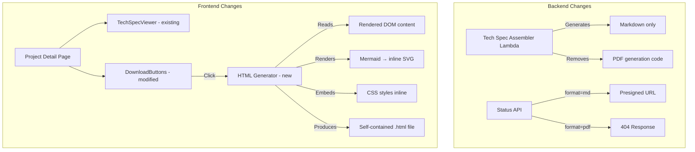

# Design Document: Markdown Viewer & HTML Download

## Overview

This feature simplifies the tech spec output pipeline by:
1. Removing PDF generation from the `tech-spec-assembler` Lambda (eliminating WeasyPrint/markdown dependencies)
2. Keeping the existing `TechSpecViewer` component for in-browser Markdown rendering (already functional)
3. Replacing the PDF download button with an HTML download button that generates a self-contained HTML file client-side

The key architectural change is shifting document formatting responsibility from the backend (Lambda PDF generation) to the frontend (client-side HTML generation). The rendered HTML download will include embedded CSS, inline SVG Mermaid diagrams, and syntax-highlighted code blocks — producing a file visually identical to the in-app preview.

## Architecture



### Design Decisions

1. **Client-side HTML generation**: The HTML file is generated in the browser rather than on the server. This avoids adding another Lambda or increasing assembler complexity. The browser already has the rendered content, Mermaid SVGs, and applied styles — we just need to serialize them.

2. **Mermaid rendered as inline SVG**: The `MermaidDiagram` component already renders Mermaid charts to SVG via the mermaid.js library. For the HTML download, we extract these SVGs directly from the DOM rather than re-rendering, ensuring visual fidelity.

3. **Embedded CSS rather than external stylesheets**: The downloaded HTML must work offline without network access. All styles (prose typography, syntax highlighting, custom component styles) are inlined into a `<style>` block.

4. **No PDF download**: Per requirements, the PDF button is removed entirely. Users who need PDF can print the HTML file to PDF via their browser.

## Components and Interfaces

### Modified Components

#### 1. Tech Spec Assembler Lambda (`src/lambdas/tech_spec_assembler/handler.py`)

**Changes:**
- Remove `_convert_markdown_to_pdf()` function
- Remove PDF upload logic from `handler()`
- Always return `pdfS3Key: null` in response

**Interface (unchanged shape, different values):**
```python
# Input: same as current
# Output:
{
    "projectId": str,
    "markdownS3Key": str,   # "outputs/{projectId}/tech-spec.md"
    "pdfS3Key": None        # Always null
}
```

#### 2. Status API Lambda (`src/lambdas/status_api/handler.py`)

**Changes:**
- Update `VALID_DOWNLOAD_FORMATS` to only include `"md"`
- Return 404 with descriptive message for `format=pdf` requests
- Update error message for unsupported formats

**Interface:**
```
GET /projects/{projectId}/download?format=md  → 200 { "downloadUrl": "..." }
GET /projects/{projectId}/download?format=pdf → 404 { "error": "PDF format is no longer available. Use format=md." }
GET /projects/{projectId}/download?format=xyz → 400 { "error": "Invalid format. Supported formats: ['md']" }
```

#### 3. DownloadButtons Component (`frontend/src/components/DownloadButtons.tsx`)

**Changes:**
- Remove PDF download button
- Replace Markdown download link with HTML download button
- Accept `markdownContent` prop (needed for HTML generation)
- On click: generate self-contained HTML and trigger browser download

**New Interface:**
```typescript
interface DownloadButtonsProps {
  projectId: string;
  markdownContent: string;
  className?: string;
}
```

### New Components

#### 4. HTML Generator Utility (`frontend/src/lib/htmlGenerator.ts`)

A pure utility module responsible for assembling a self-contained HTML string from Markdown content.

**Interface:**
```typescript
/**
 * Generates a self-contained HTML document from Markdown content.
 * - Renders Markdown to HTML with GFM support
 * - Renders Mermaid code blocks as inline SVG
 * - Embeds all CSS styles inline
 * - Includes syntax-highlighted code blocks
 */
export async function generateStandaloneHtml(markdownContent: string): Promise<string>;

/**
 * Triggers a browser file download for the given content.
 */
export function downloadAsFile(content: string, filename: string, mimeType: string): void;
```

**Implementation approach:**
1. Parse Markdown using the same pipeline as `TechSpecViewer` (react-markdown + remark-gfm)
2. For Mermaid blocks: use mermaid.js `render()` to produce SVG strings
3. For code blocks: apply highlight.js for syntax highlighting
4. Wrap in an HTML document template with embedded CSS
5. Trigger download via `Blob` + `URL.createObjectURL` + programmatic anchor click

### Unchanged Components

- **TechSpecViewer**: No changes needed. Already renders Markdown with GFM, syntax highlighting, and Mermaid diagrams.
- **MermaidDiagram**: No changes needed. Used only for in-app rendering.
- **Project Detail Page**: Minor change to pass `markdownContent` to `DownloadButtons`.

## Data Models

### Backend Response Models

No new data models are introduced. The existing response shapes are preserved:

```typescript
// Tech Spec Assembler output (pdfS3Key always null now)
interface AssemblerOutput {
  projectId: string;
  markdownS3Key: string;
  pdfS3Key: null;
}

// Status API download response (unchanged)
interface DownloadResponse {
  downloadUrl: string;
}

// Status API error response (unchanged shape)
interface ErrorResponse {
  error: string;
}
```

### Frontend State

No new state models. The existing `markdownContent: string | null` state in the project detail page is passed through to `DownloadButtons`.


## Correctness Properties

*A property is a characteristic or behavior that should hold true across all valid executions of a system — essentially, a formal statement about what the system should do. Properties serve as the bridge between human-readable specifications and machine-verifiable correctness guarantees.*

### Property 1: Generated HTML is a valid self-contained document

*For any* valid Markdown string (including empty string), `generateStandaloneHtml` SHALL produce output that contains a `<!DOCTYPE html>` declaration, an `<html>` root element, a `<head>` element, and a `<body>` element.

**Validates: Requirements 4.2**

### Property 2: Generated HTML embeds all styles inline with no external dependencies

*For any* valid Markdown string, the HTML output of `generateStandaloneHtml` SHALL contain at least one `<style>` block and SHALL NOT contain any `<link rel="stylesheet">` tags or external resource references.

**Validates: Requirements 4.3**

### Property 3: Mermaid code blocks are rendered as inline SVG

*For any* Markdown string containing one or more fenced code blocks with the `mermaid` language identifier, the HTML output of `generateStandaloneHtml` SHALL contain a corresponding `<svg` element for each mermaid block and SHALL NOT contain any raw mermaid code fence in the output body.

**Validates: Requirements 4.4**

### Property 4: Code blocks include syntax highlighting markup

*For any* Markdown string containing one or more fenced code blocks with a language identifier (e.g., `typescript`, `python`), the HTML output of `generateStandaloneHtml` SHALL contain `<code>` elements with highlight class attributes (e.g., `hljs`) or inline style attributes for syntax coloring.

**Validates: Requirements 4.5**

## Error Handling

### Backend

| Scenario | Handling |
|----------|----------|
| Tech Spec Assembler fails to upload Markdown to S3 | Lambda raises exception, Step Functions marks stage as FAILED, error propagates to status API |
| Status API receives `format=pdf` | Returns 404 with message: "PDF format is no longer available. Use format=md." |
| Status API receives unknown format | Returns 400 with message listing supported formats |
| Status API cannot find job record | Returns 404 (existing behavior, unchanged) |
| Presigned URL generation fails | Returns 500 with generic error (existing behavior) |

### Frontend

| Scenario | Handling |
|----------|----------|
| Markdown fetch returns 404 | Display "Tech spec is not yet available" message |
| Markdown fetch network error | Display error message with retry button |
| Markdown fetch timeout | Display timeout error with retry button (existing `ApiTimeoutError`) |
| Mermaid rendering fails during HTML generation | Include the raw mermaid code in a `<pre>` block with error note (graceful degradation) |
| HTML generation fails | Show toast/error notification, do not trigger download |
| Generated HTML is empty or malformed | Should not occur given valid Markdown input; if it does, show error toast |

## Testing Strategy

### Unit Tests (Example-Based)

**Backend:**
- Tech Spec Assembler: verify handler returns `pdfS3Key: null`, no PDF upload occurs, Markdown upload succeeds
- Status API: verify `format=pdf` returns 404, `format=md` returns presigned URL, invalid format returns 400

**Frontend:**
- DownloadButtons: renders "Download HTML" button, does NOT render PDF button
- Project detail page: fetches Markdown on COMPLETED status, shows loading state, shows error on failure
- TechSpecViewer: renders GFM tables, code blocks get highlight classes, mermaid blocks route to MermaidDiagram

### Property-Based Tests

**Library:** fast-check (already in devDependencies)
**Minimum iterations:** 100 per property

| Property | Test Description | Tag |
|----------|-----------------|-----|
| 1 | Generate random Markdown strings (including empty, whitespace-only, special chars), verify output has valid HTML structure | Feature: markdown-viewer-download, Property 1: Generated HTML is a valid self-contained document |
| 2 | Generate random Markdown strings, verify output contains `<style>` and no `<link rel="stylesheet">` | Feature: markdown-viewer-download, Property 2: Generated HTML embeds all styles inline |
| 3 | Generate Markdown with random mermaid diagram definitions, verify SVG presence and no raw mermaid fences | Feature: markdown-viewer-download, Property 3: Mermaid code blocks rendered as inline SVG |
| 4 | Generate Markdown with random code blocks (various languages), verify highlight markup in output | Feature: markdown-viewer-download, Property 4: Code blocks include syntax highlighting |

### Integration Tests

- End-to-end: trigger pipeline, wait for completion, verify Markdown is fetchable and renders in browser
- Visual regression: compare downloaded HTML opened in browser against in-app preview (manual or screenshot-based)

### What Is NOT Tested with PBT

- S3 uploads and presigned URL generation (infrastructure — use integration tests)
- UI conditional rendering (specific scenarios — use example-based component tests)
- Visual fidelity of downloaded HTML (requires visual comparison — manual testing)
